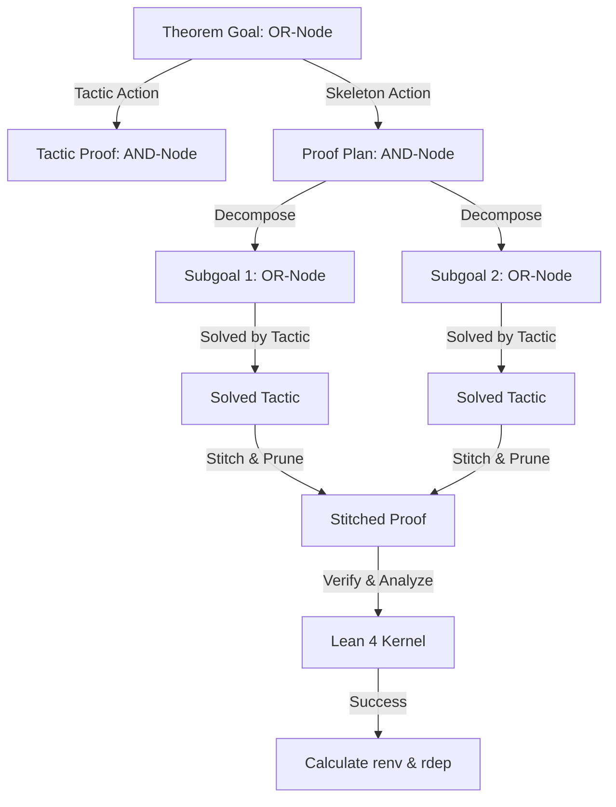

# Báo Cáo Phân Tích Kiến Trúc Hệ Thống GammaZero
> [!NOTE]
> Báo cáo này cung cấp cái nhìn chi tiết và toàn diện nhất về cơ chế hoạt động, các thuật toán heuristics, hệ thống phần thưởng (rewards), và cách vận hành của framework **GammaZero** trong việc chứng minh định lý tự động sử dụng mô hình ngôn ngữ lớn (LLM) và ngôn ngữ Lean 4.

---

## 1. Kiến Trúc Tổng Quan (System Architecture)

GammaZero là một framework chứng minh định lý tự động dựa trên **Học tăng cường (Reinforcement Learning - RL)** và tìm kiếm trên **Đồ thị AND/OR (AND/OR Proof Search Graph)**. Thay vì chỉ tìm kiếm tuyến tính từng bước tactic (như các hệ thống truyền thống), GammaZero kết hợp cả hai cơ chế:
1. **Tactic-level Search**: Sinh các bước chứng minh trực tiếp bằng tactic.
2. **Skeleton-level Search**: Phân rã bài toán lớn thành các bổ đề phụ (subgoals/hypotheses) dưới dạng một bộ khung chứng minh (skeleton) chứa các từ khóa `sorry`, sau đó giải quyết từng bổ đề một cách độc lập trước khi ráp nối lại.

Sơ đồ hoạt động tổng quan của hệ thống:



---

## 2. Cấu Trúc Đồ Thị Tìm Kiếm AND/OR (AND/OR Proof Search Graph)

Được định nghĩa tại [nodes.py](file:///workspace/npthai/BetaZero/gammazero/core/nodes.py) và quản lý tại [and_or_graph.py](file:///workspace/npthai/BetaZero/gammazero/search/graph/and_or_graph.py):

*   **OR-Node (`ProofState`)**: Đại diện cho một trạng thái chứng minh hiện tại bao gồm giả thiết (`context`) và mục tiêu (`goal`). Một OR-node được coi là **SOLVED** nếu **chỉ cần ít nhất một** Action con của nó được giải quyết thành công (Cổng **OR**).
*   **AND-Node (`Action`)**: Đại diện cho hành động chứng minh (`tactic` hoặc `skeleton`). Một AND-node được coi là **SOLVED** nếu **tất cả** các mục tiêu con (`children: tuple[ProofState, ...]`) được giải quyết thành công (Cổng **AND**).

### Cơ chế Lan Truyền Trạng Thái (Solved State Propagation)
Đồ thị thực hiện cập nhật ngược trạng thái giải được (`is_solved`) từ dưới lên trên theo các quy tắc sau:
1. Đối với **Tactic Action**: Giải được nếu hệ thống Lean 4 xác nhận tactic đó hợp lệ và đóng hoàn toàn mục tiêu (`tactic_status == "SOLVED"`).
2. Đối với **Skeleton Action**: Giải được nếu tất cả các `children` của nó đều đạt trạng thái `SOLVED`. Tuy nhiên, đồ thị hỗ trợ cơ chế **override** trạng thái (`skeleton_override`) khi bộ ráp nối và máy xén chứng minh (`ProofStitcher`) có thể loại bỏ hoàn toàn các nhánh con bị lỗi nhưng không ảnh hưởng tới chứng minh tổng thể (được giải thích ở phần dưới).

---

## 3. Môi Trường Thực Thi Lean 4 Siêu Tốc (Persistent Lean 4 Environment)

Để kiểm tra mã nguồn Lean 4 nhanh chóng, GammaZero phát triển bộ lập lịch và các tiến trình worker duy trì trạng thái nằm tại [lean_verifier.py](file:///workspace/npthai/BetaZero/gammazero/env/lean_verifier.py):

### Cơ chế Tăng Tốc Nhập Thư Viện (Mathlib Warmup State Reuse)
Thông thường, việc biên dịch một file Lean chứa dòng `import Mathlib` mất khoảng **5 đến 10 giây** khởi động. Đây là nút thắt cổ chai cực kỳ lớn cho các thuật toán tìm kiếm cây vốn yêu cầu kiểm tra hàng ngàn nhánh.
GammaZero giải quyết triệt để vấn đề này bằng cách:
1. Khởi chạy một tiến trình persistent thông qua công cụ REPL của Lean (`lake exe repl`).
2. Gửi lệnh khởi động: `{"cmd": "import Mathlib\nset_option linter.unusedVariables false"}`.
3. Nhận lại trạng thái môi trường đã được biên dịch (`env` ID) từ Lean compiler.
4. Ở các lượt biên dịch tiếp theo, worker chỉ cần đính kèm `"env": env_id` vào JSON payload. Nhờ vậy, Lean **không cần import lại Mathlib**, rút ngắn thời gian xác thực xuống chỉ còn **vài mili-giây**.

### Cơ chế Bảo Vệ & Giám Sát (Watchdog & Resource Flush)
*   **Watchdog (Bom hẹn giờ)**: Một số tactic mạnh của Lean (như `omega`, `simp`, `ring`) có thể rơi vào vòng lặp vô hạn hoặc tính toán quá lâu khi gặp mã nguồn sai cú pháp. Hệ thống tích hợp một `threading.Timer` (mặc định 20 giây hoặc 60 giây). Nếu Lean REPL không trả về phản hồi kịp thời, luồng giám sát sẽ bắn tín hiệu `SIGKILL` để tiêu diệt tiến trình Lean và hồi sinh tiến trình mới ngay lập tức.
*   **Rửa bộ nhớ (Memory Flush)**: Lean compiler nổi tiếng với việc rò rỉ RAM khi biên dịch hàng trăm đoạn code liên tục. Worker tự động theo dõi `request_count` và tự khởi động lại (`respawn`) sau mỗi **500 yêu cầu** để làm sạch bộ nhớ.

---

## 4. Phân Tích Phụ Thuộc Bậc Sâu Trong Nhân Lean (Expr Tree Dependency Analysis)

Đây là **phát kiến cốt lõi** và là điểm độc đáo nhất của hệ thống GammaZero. Nằm tại [dependency_analyzer.py](file:///workspace/npthai/BetaZero/gammazero/search/sorrifier/dependency_analyzer.py), module này thực hiện phân tích AST biểu thức của Lean để phát hiện các mối quan hệ phụ thuộc thực tế trong chứng minh.

Khi ta khai báo bổ đề phụ bằng cấu trúc `have h1 : P := proof1`, Lean compiler thực chất sẽ biên dịch nó dưới dạng:
*   Phép gán cục bộ: `letE (var_name: h1, val: proof1, body: ...)`
*   Hoặc áp dụng hàm Lambda: `app(fn: lam(var_name: h1, body: ...), arg: proof1)`

### Phân Loại Subgoal (Subgoal Classification)
`ExprDependencyAnalyzer` sẽ duyệt đệ quy cây biểu thức Lean (`ExprTree`) bằng chỉ số De Bruijn (De Bruijn indices) để kiểm tra xem biến giả thuyết `h1` (index 0 trong scope con) có thực sự được sử dụng trong biểu thức chứng minh cuối cùng (`body`) hay không. Từ đó chia các bổ đề phụ thành 4 nhóm:

| Nhóm Subgoal | Trạng Thái | Có Được Sử Dụng Trực Tiếp Trong Chứng Minh Cuối? | Mô Tả Ý Nghĩa |
| :--- | :--- | :--- | :--- |
| **`core_solved`** | Đã giải được (Không chứa `sorry`) | **Có** | Đây là mảnh ghép quan trọng giúp chứng minh định lý thành công. |
| **`core_failed`** | Thất bại (Chứa `sorry`) | **Có** | Lỗi nghiêm trọng: Chứng minh chính phụ thuộc vào bổ đề này nhưng bổ đề này chưa giải được. |
| **`benign`** | Đã giải được (Không chứa `sorry`) | *Không* | Bổ đề thừa: Đã mất công giải nhưng kết quả cuối cùng không cần dùng tới. |
| **`malignant`** | Thất bại (Chứa `sorry`) | *Không* | **"Khối u ác tính"**: Bổ đề bị bỏ dở chứa `sorry` khiến Lean báo lỗi chưa chứng minh xong, nhưng thực tế chứng minh chính không dùng tới nó nên có thể cắt bỏ để cứu toàn bộ chứng minh! |

### Kỹ Thuật Máy Xén Pruning (Dependency-based Pruning)
Từ phân tích trên, nếu hệ thống phát hiện các biến thuộc nhóm `malignant` hoặc `benign`, bộ ráp nối [stitcher.py](file:///workspace/npthai/BetaZero/gammazero/search/sorrifier/stitcher.py) sẽ **bật máy xén tự động loại bỏ dòng khai báo bổ đề đó cùng toàn bộ block proof thụt lề sâu hơn của nó**.

> [!IMPORTANT]
> **Hiệu quả thực tế**: Cơ chế này cho phép GammaZero biến một chứng minh ban đầu bị Lean báo lỗi vì chứa `sorry` (nằm trong các nhánh `malignant` thừa thãi do LLM sinh ra) thành một **chứng minh hoàn hảo 100% không còn sorry**.

---

## 5. Sorrifier: Bộ Sửa Lỗi AST Tự Động (AST-Based Fault Repair)

Được triển khai tại [sorrifier.py](file:///workspace/npthai/BetaZero/gammazero/search/sorrifier/sorrifier.py), `Sorrifier` đóng vai trò như một kỹ sư sửa lỗi tự động bằng cách tương tác liên tục với trình xác thực Lean 4.

### Quy Trình Vá Lỗi Từng Bước (Iterative Repair Pipeline)
1. **Quét lỗi**: Đọc thông điệp lỗi biên dịch từ Lean. Phân loại thành lỗi cú pháp nghiêm trọng (Fatal error) và mục tiêu chưa giải xong (Unsolved goals).
2. **AST Truncation (Cắt tỉa theo AST)**: Sử dụng AST parser của Lean để xác định chính xác ranh giới dòng của đoạn tactic bị lỗi cú pháp, thay thế nó bằng `sorry` hoặc xóa hẳn nếu nó là một tactic mồ côi (không còn mục tiêu nào để áp dụng).
3. **Đóng Scope tự động**: Nếu gặp lỗi "chưa giải xong" ở cuối khối (`have` hoặc `let`), hệ thống sẽ tự động tính toán độ thụt lề (indentation) thích hợp để chèn từ khóa `sorry` vào cuối scope nhằm đóng băng lỗi, giúp Lean tiếp tục biên dịch các phần tiếp theo.
4. **Boss-Hunting Fallback (Diệt Trùm)**: Khi gặp hiện tượng dao động sửa lỗi vô hạn (cùng một lỗi lặp đi lặp lại), hệ thống sẽ kích hoạt bộ "săn trùm". Nó lùi ngược về dòng định nghĩa block cha gần nhất (`have`, `let`, `theorem`) và **hollow out (làm rỗng)** toàn bộ block đó, thay bằng lệnh `by sorry` và xóa toàn bộ các dòng thụt lề con phía sau.
5. **Deadlock Breaker**: Nếu các bước trên vẫn không thay đổi được mã nguồn, nó sẽ ép buộc xóa hoàn toàn dòng lỗi để thoát khỏi bế tắc.

---

## 6. Bộ Máy Tìm Kiếm Cây Best-First & Heuristics

GammaZero không dùng MCTS thuần túy mà sử dụng thuật toán **Best-First Search định hướng Beam** trên đồ thị AND/OR nằm tại [best_first_rollout.py](file:///workspace/npthai/BetaZero/gammazero/search/rollout/best_first_rollout.py). 

Bộ tìm kiếm hoạt động qua hai giai đoạn thăm dò kế tiếp: **Tactic Probe** (sinh bước chứng minh trực tiếp) và **Skeleton Probe** (phân rã thành các bổ đề phụ). Sự chuyển dịch và phối hợp giữa hai giai đoạn này được kiểm soát chặt chẽ bởi các heuristics và cấu hình trong [api.yaml](file:///workspace/npthai/BetaZero/configs/api.yaml).

### 6.1 Cơ Chế Probe Tactic và Phân Kỳ Tactic -> Skeleton (Heuristic Transition Control)
Khi một trạng thái OR-node mới được đưa vào hàng đợi, hệ thống luôn ưu tiên chạy tactic probe trước nhằm tìm kiếm các bước chứng minh trực tiếp ngắn gọn mà không làm bùng nổ đồ thị. Sự chuyển dịch sang skeleton được quy định thông qua hàm `should_expand_skeleton`:

1. **Điều kiện Tactic tối thiểu (`min_tactic_before_skeleton = 8`)**:
   * Một trạng thái bắt buộc phải chạy tactic probe tối thiểu **8 lần** trước khi được phép kích hoạt skeleton probe. Điều này đảm bảo ta đã thăm dò đủ sâu các tactic tiềm năng trước khi quyết định "chia để trị" bài toán.
2. **Trì hoãn khi gặp tactic hứa hẹn (`promising_tactic_r_env = 0.4` & `strong_tactic_r_env = 0.7`)**:
   * Nếu trong các lượt tactic probe trước đó, ta tìm thấy một tactic đạt survival rate $r_{env} \ge 0.4$ (hứa hẹn) hoặc $r_{env} \ge 0.7$ (rất mạnh), hệ thống sẽ **trì hoãn hoàn toàn việc mở rộng skeleton** trên trạng thái này.
   * Thay vào đó, hệ thống tiếp tục ép buộc chạy thêm tactic probe cho đến khi đạt ngưỡng giới hạn `max_tactic_per_state = 32`. Heuristic này giúp dồn tài nguyên giải quyết trực tiếp khi đã cận kề lời giải tactic tốt, tránh việc phân rã cồng kềnh không cần thiết.
3. **Độc quyền Commit**:
   * Nếu trạng thái đã cam kết vào một skeleton (`committed_skeleton is not None`) hoặc đang có các skeleton dự phòng chờ kích hoạt (`reserved_skeletons`), hệ thống sẽ chặn đứng hoàn toàn việc sinh thêm skeleton mới trên trạng thái đó nhằm tối ưu hóa budget.

---

### 6.2 Hệ Thống Tham Số Cấu Hình Search (Config Parameter Analysis)
Dưới đây là chi tiết ý nghĩa và tầm ảnh hưởng của các tham số cấu hình trong [api.yaml](file:///workspace/npthai/BetaZero/configs/api.yaml) tới hành vi duyệt đồ thị:

#### A. Hạn Ngạch & Song Song Hóa (Sampling Width & Budget)
*   **`initial_tactic_k = 4` / `retry_tactic_k = 2`**: 
    *   Ở lần thăm dò tactic đầu tiên, ta sinh song song 4 tactics (`initial_tactic_k`). Nếu thất bại và phải quay lại thử tiếp (retry), ta sinh với bước nhỏ hơn là 2 (`retry_tactic_k`) để tiết kiệm token và thời gian chạy.
*   **`initial_skeleton_k = 4` / `retry_skeleton_k = 2`**:
    *   Cơ chế tương tự để sinh các bộ khung chứng minh (skeleton) song song ở lượt đầu tiên và lượt thử lại.
*   **`max_tactic_per_state = 32` / `max_skeleton_per_state = 32`**:
    *   Giới hạn trần số lượt thăm dò tactic và skeleton tối đa trên mỗi trạng thái để ngăn ngừa việc kẹt tài nguyên (infinite loops) ở một bài toán con quá khó.
*   **`max_nodes = 1024`**:
    *   Giới hạn kích thước tối đa của toàn bộ cây tìm kiếm (tổng số node OR và AND). Khi vượt quá ngưỡng này, rollout sẽ kết thúc ngay lập tức.

#### B. Độ Rộng Lọc Beam (Beam Widths)
*   **`search_batch_size = 4`**:
    *   Số lượng trạng thái OPEN tốt nhất được pop ra khỏi hàng đợi ưu tiên để tiến hành sinh và xác thực đồng thời trong mỗi chu kỳ rollout.
*   **`state_beam_width = 24`**:
    *   Kích thước tối đa của hàng đợi ưu tiên `StatePriorityQueue`. Chỉ giữ lại 24 trạng thái hứa hẹn nhất để đi tiếp, loại bỏ các trạng thái điểm thấp nhằm tránh phình to cây.
*   **`state_beam_per_depth = 8`**:
    *   Giới hạn số lượng trạng thái OPEN tối đa trên **mỗi tầng độ sâu** của cây tìm kiếm. Giúp cây phát triển cân đối, không bị lệch quá sâu hoặc phình quá rộng ở một tầng cụ thể.

#### C. Quản Lý Cam Kết Khung (Skeleton Commitment & Fallback)
*   **`skeleton_commitment = true`**:
    *   Bật cơ chế "cam kết". Khi một skeleton được chọn là tốt nhất, hệ thống sẽ "khóa" trạng thái cha lại và chỉ dồn tài nguyên giải các subgoal của skeleton này, không lan man sinh skeleton khác.
*   **`max_reserved_skeletons_per_state = 2`**:
    *   Hộp lưu trữ dự phòng: Lưu lại tối đa 2 skeleton tốt tiếp theo phòng trường hợp skeleton cam kết chính bị bế tắc.
*   **`commit_stale_rounds_before_fallback = 2`**:
    *   Nếu sau 2 vòng tìm kiếm liên tiếp mà các subgoal của skeleton cam kết không đạt thêm tiến triển nào (stale), hệ thống tự động kích hoạt **fallback**: hủy cam kết cũ, lấy skeleton trong hộp dự phòng ra để giải quyết.

---

### 6.3 Cơ Chế Cam Kết Khung Chứng Minh (Skeleton Commitment & Fallback)
Khi mở rộng một trạng thái (OR-node), mô hình sinh ra nhiều bộ khung chứng minh khác nhau. Để tránh phân tán tài nguyên tìm kiếm:
1. **Cam kết (Commitment)**: Hệ thống chấm điểm các skeleton và chọn ra một skeleton tốt nhất để **cam kết**.
2. **Khóa nhánh**: Khi đã cam kết vào một skeleton, hệ thống sẽ tạm dừng sinh các skeleton mới cho trạng thái đó, tập trung toàn bộ hạn ngạch (budget) tìm kiếm để giải quyết các subgoal của skeleton này.
3. **Hộp lưu trữ dự phòng (Reserved Skeletons)**: Các skeleton tốt thứ 2, thứ 3 sẽ được chuyển vào danh sách chờ (`reserved_skeletons`).
4. **Fallback khi bế tắc**: Nếu skeleton cam kết bị rơi vào trạng thái bế tắc (Stale - không có subgoal nào được giải quyết thêm sau $N$ lượt) hoặc có một subgoal con bị xác định là `FAILED`, hệ thống sẽ hủy bỏ cam kết cũ, lấy skeleton tốt nhất trong danh sách dự phòng ra để kích hoạt và đẩy các subgoal con của nó vào hàng đợi.

---

### 6.4 Công Thức Điểm Heuristic Cho Trạng Thái (State Scoring)
Được cài đặt trong [heuristic.py](file:///workspace/npthai/BetaZero/gammazero/search/rollout/heuristic.py). Trọng số mặc định được lấy từ cấu hình [api.yaml](file:///workspace/npthai/BetaZero/configs/api.yaml):

$$\text{Score}(s) = 2.0 \cdot \text{IncomingSkeletonScore} + 1.5 \cdot \text{BestTacticSurvivalRate} + \text{ParentCompletionBonus} + \text{RootCriticalBonus} + \text{CommittedChildBonus} - \text{Penalties}$$

Trong đó:
*   **ParentCompletionBonus**: Cực kỳ ưu tiên các subgoal là **mảnh ghép cuối cùng** của một bộ khung chứng minh. Nếu giải xong subgoal này, toàn bộ chứng minh cha sẽ được đóng lại!
    *   Nếu cha ở gần gốc (depth $\le 1$): Cộng thêm **12.0** điểm.
    *   Các tầng khác: Cộng thêm **6.0** điểm.
*   **CommittedChildBonus**: Nếu trạng thái con thuộc về một skeleton đã được cam kết, nó được cộng thêm **8.0** điểm. Đặc biệt, nếu nó là subgoal mở cuối cùng của skeleton cam kết đó, nó nhận thêm **20.0** điểm thưởng khổng lồ! Điều này tạo ra lực đẩy cực kỳ mạnh mẽ bắt buộc hệ thống phải dồn toàn lực hoàn thành nốt các chi tiết cuối cùng của một kế hoạch đã định sẵn.
*   **RootCriticalBonus**: Ưu tiên giải quyết các trạng thái gần gốc để tránh đi quá sâu vào các nhánh phụ vô vọng.
*   **Penalties**: Trừ điểm dựa trên độ sâu cây (`depth_penalty`), số lần thử tactic thất bại (`tactic_retry_penalty`), số lần thử skeleton thất bại (`skeleton_retry_penalty`).

---

### 6.5 Điểm Heuristic Cho Skeleton (Skeleton Scoring)
Hệ thống chấm điểm một skeleton mới sinh ra dựa trên:
1.  **Skeleton Survival Rate ($r_{env}$)**: Điểm số giữ lại của bộ khung khi đi qua Lean compiler. (Lưu ý: Điểm này **không phải lúc nào cũng bằng 1.0**. Nếu skeleton bị lỗi và phải đi qua `Sorrifier` để vá/cắt tỉa, $r_{env}$ sẽ bị giảm xuống dưới 1.0. Các cảnh báo về biến rác/unused variables trong context thực tế đã được vô hiệu hóa bằng cách cấu hình `set_option linter.unusedVariables false` ở môi trường Lean, do đó LLM sẽ không bị phạt nhầm vì các giả thiết dư thừa sẵn có của bài toán!).
2.  **Child Count Score**: Số lượng bổ đề phụ phân rã ra phải hợp lý.
    *   $n = 0$: **-2.0** điểm (Phạt nặng vì đây thường là hành vi hollow out toàn bộ, không phân rã gì cả).
    *   $n = 1$: **+0.2** điểm (Phạt nhẹ vì phân rã quá ít).
    *   $n \in \{2, 3\}$: **+1.0** điểm (**Tỷ lệ phân rã vàng** - tối ưu cho tư duy chứng minh).
    *   $n = 4$: **+0.5** điểm.
    *   $n > 4$: Phạt lùi $-0.3 \cdot (n - 4)$ vì sinh quá nhiều bổ đề vụn vặt gây bùng nổ không gian tìm kiếm.

---

## 7. Thiết Kế Điểm Thưởng (Reward Design)

GammaZero thiết kế 2 hệ thống phần thưởng độc lập để phục vụ cho việc tính toán $Q$-value và đánh giá chất lượng:

### 1. Phần Thưởng Môi Trường (Environment Survival Reward - $r_{env}$)
Đánh giá chất lượng đoạn code sinh ra dựa trên tỷ lệ dòng code gốc còn nguyên vẹn sau khi đã sửa lỗi bằng `Sorrifier`.
Sử dụng thuật toán **Longest Common Subsequence (LCS)** trên tập hợp các dòng code sạch (không chứa dòng trống hay comment):

$$r_{env} = \frac{\max(0, L_{surviving} - \text{dead\_count})}{L_{original}}$$

*   $L_{original}$: Số lượng dòng code sạch do LLM sinh ra ban đầu.
*   $L_{surviving}$: Số lượng dòng code ban đầu trùng khớp hoàn toàn và còn tồn tại trong bản vá lỗi.
*   $\text{dead\_count}$: Số lượng cảnh báo từ trình xác thực Lean chỉ ra dòng code đó là các cảnh báo thừa thãi ảnh hưởng tiêu cực tới chứng minh (ví dụ: `"does nothing"`). 
*   *Ý nghĩa*: Tránh hiện tượng lạm phát điểm. Ngăn chặn việc LLM sinh ra một đoạn chứng minh cực kỳ dài nhưng chứa đầy lỗi, sau đó bị hollowing out sạch sẽ thành một dòng `sorry` duy nhất (khi đó $L_{surviving} \approx 0 \implies r_{env} \approx 0$).

> [!TIP]
> **Lưu ý quan trọng đối với Skeletons**: Skeletons cũng có $r_{env}$ và **KHÔNG phải lúc nào cũng bằng 1.0**. 
> 1. **Khi Skeleton bị lỗi biên dịch**: Hệ thống sử dụng `Sorrifier` để loại bỏ các đoạn code bị lỗi cú pháp/typecheck và thay thế bằng `sorry` để tạo ra bản vá biên dịch được. Bản vá bị mất đi một lượng dòng code so với skeleton gốc, dẫn đến $L_{surviving} < L_{original} \implies r_{env} < 1.0$ (có thể tiến về 0.0 nếu bị xóa rỗng toàn bộ).
> 2. **Khi Skeleton chứa cảnh báo thừa thãi**: Nếu code sinh ra có các cảnh báo nghiêm trọng từ Lean linter (không bao gồm unused variables do đã được tắt bằng `set_option linter.unusedVariables false`), chúng sẽ làm tăng `dead_count` và trừ trực tiếp vào điểm sinh tồn, khiến $r_{env}$ thấp hơn 1.0.
> 3. **Khi Skeleton vi phạm Policy**: Bị set cứng $r_{env} = 0.0$ (như khi restate parent goal).

### 2. Phần Thưởng Phụ Thuộc (Weighted Dependency Reward - $r_{dep}$)
Đánh giá tính chặt chẽ, tối giản của các bổ đề phụ được sinh ra trong cấu trúc skeleton:

$$r_{dep} = \frac{n_c}{n_c + 0.5 \cdot n_b + 2.0 \cdot n_m}$$

*   $n_c$ (core_solved): Số lượng bổ đề phụ hữu ích đã được giải xong.
*   $n_b$ (benign): Số lượng bổ đề thừa đã giải xong nhưng không dùng đến (Phạt nhẹ $0.5$ vì lãng phí tài nguyên).
*   $n_m$ (malignant): Số lượng bổ đề lỗi chứa sorry nhưng không dùng đến (Phạt nặng $2.0$ vì sinh rác lỗi vào chứng minh).
*   *Ý nghĩa*: Thúc đẩy mô hình sinh ra các bộ khung chứng minh tinh gọn, sạch sẽ, chỉ tập trung vào các giả thuyết thực sự cần thiết để giải bài toán.

---

## 8. Đề Xuất Khung Kiến Trúc Tối Giản (Mini Proposed Framework Draft)

Dưới đây là bản thiết kế tối giản bằng mã Python, mô phỏng lại toàn bộ cơ chế cốt lõi của GammaZero để bạn có thể nắm bắt cách các bộ phận liên kết với nhau một cách trực quan nhất:

```python
import re
from dataclasses import dataclass, field
from typing import Literal, List, Dict, Tuple, Set

# ==========================================
# 1. CORE NODES & GRAPH
# ==========================================
@dataclass(frozen=True)
class ProofState:
    context: str
    goal: str
    header: str = ""

@dataclass
class Action:
    action_type: Literal["tactic", "skeleton"]
    content: str
    extracted_code: str
    children: Tuple[ProofState, ...] = field(default_factory=tuple)

class MiniANDORGraph:
    def __init__(self, root: ProofState):
        self.actions: Dict[ProofState, List[Action]] = {root: []}
        self.parents: Dict[Action, ProofState] = {}
        self.r_env: Dict[Action, float] = {}
        self.r_dep: Dict[Action, float] = {}
        self.tactic_status: Dict[Action, Literal["SOLVED", "FAILED"]] = {}
        self.skeleton_override: Dict[Action, bool] = {}

    def expand(self, state: ProofState, action: Action, r_env=0.0, r_dep=0.0):
        self.actions.setdefault(state, []).append(action)
        self.parents[action] = state
        self.r_env[action] = r_env
        self.r_dep[action] = r_dep
        for child in action.children:
            self.actions.setdefault(child, [])

    def is_solved(self, node: ProofState | Action) -> bool:
        if isinstance(node, ProofState):
            # Cổng OR: Chỉ cần một action con giải được
            return any(self.is_solved(a) for a in self.actions.get(node, []))
        
        # Node là Action
        if node.action_type == "tactic":
            return self.tactic_status.get(node) == "SOLVED"
        
        # Node là Skeleton
        if node in self.skeleton_override:
            return self.skeleton_override[node]
        # Cổng AND: Phải giải được tất cả các subgoal con
        return bool(node.children) and all(self.is_solved(c) for c in node.children)

# ==========================================
# 2. DEP ANALYZER & MACHINE PRUNER
# ==========================================
class MiniExprDependencyAnalyzer:
    """Mô phỏng bộ phân tích chỉ số De Bruijn trên nhân Lean 4"""
    def analyze(self, root_expr_json: dict, target_vars: Set[str]) -> Dict[str, List[str]]:
        # Thực tế duyệt AST để tìm xem biến nào được dùng ở body chính
        # Trả về phân loại: core_solved, core_failed, benign, malignant
        return {
            "core_solved": ["h1"],
            "core_failed": [],
            "benign": [],
            "malignant": ["h2_sorry_unused"]  # Đây là biến rác cần Prune
        }

class MiniProofStitcher:
    @staticmethod
    def stitch(skeleton_code: str, child_proofs: List[str]) -> str:
        parts = skeleton_code.split("sorry")
        stitched = parts[0]
        for i, proof in enumerate(child_proofs):
            stitched += f"by\n  {proof}\n" + parts[i + 1]
        return stitched

    @staticmethod
    def prune_garbage(stitched_code: str, garbage_vars: List[str]) -> str:
        """Quét và loại bỏ hoàn toàn các khối chứng minh của biến rác"""
        lines = stitched_code.splitlines()
        pruned_lines = []
        skip_mode = False
        base_indent = 0
        
        for line in lines:
            # Phát hiện dòng khai báo của biến rác
            if any(re.search(rf"\b(have|let)\s+{re.escape(var)}\b", line) for var in garbage_vars):
                pruned_lines.append(f"-- [PRUNED] {line}")
                base_indent = len(line) - len(line.lstrip())
                skip_mode = True
                continue
            
            if skip_mode:
                if not line.strip():
                    pruned_lines.append(line)
                    continue
                curr_indent = len(line) - len(line.lstrip())
                if curr_indent > base_indent:
                    pruned_lines.append(f"-- [PRUNED] {line}")
                    continue
                else:
                    skip_mode = False
            pruned_lines.append(line)
        return "\n".join(pruned_lines)

# ==========================================
# 3. REPL WORKER WITH WARMUP STATE
# ==========================================
class MiniPersistentLeanWorker:
    def __init__(self):
        self.base_env_id = None
        self._start_repl_and_warmup()

    def _start_repl_and_warmup(self):
        # Khởi chạy 'lake exe repl'
        # Gửi payload: {"cmd": "import Mathlib"}
        # Nhận lại env_id lưu vào self.base_env_id
        self.base_env_id = "mathlib_warmed_up_env_001"
        print("[Warmup] Khởi tạo thành công môi trường nền Mathlib.")

    def verify(self, code: str) -> dict:
        # Gửi kèm self.base_env_id để Lean biên dịch trong vài mili-giây
        payload = {"cmd": code, "env": self.base_env_id}
        # Trả về kết quả xác thực giả lập
        return {"pass": True, "complete": "sorry" not in code, "sorries": []}

# ==========================================
# 4. BEST-FIRST SEARCH ENGINE
# ==========================================
class MiniBestFirstRollout:
    def __init__(self, lean_worker: MiniPersistentLeanWorker):
        self.lean = lean_worker
        self.stitcher = MiniProofStitcher()
        self.analyzer = MiniExprDependencyAnalyzer()

    def rollout(self, root: ProofState):
        graph = MiniANDORGraph(root)
        # 1. Sinh các Tactic và Skeleton Action bằng LLM API
        # 2. Đưa các trạng thái vào Priority Queue dựa trên Heuristic Scorer
        # 3. Thực hiện Cam kết Skeleton (Commitment)
        # 4. Khi hoàn thành: Thực hiện ráp nối (Stitch) các subgoal con
        # 5. Phân tích phụ thuộc bậc sâu (ExprDependencyAnalyzer)
        # 6. Kích hoạt Máy Xén (Pruner) loại bỏ các malignant/benign subgoals
        # 7. Biên dịch kiểm thử chứng minh tối giản cuối cùng bằng Lean
        # 8. Tính điểm thưởng renv, rdep và cập nhật ngược đồ thị
        return graph
```

---

## 9. Kết Luận (Summary of Strengths)

Hệ thống GammaZero sở hữu 3 điểm mạnh vượt trội tạo nên hiệu năng chứng minh đỉnh cao:
1.  **Tốc độ phản hồi cực hạn**: Nhờ cơ chế tái sử dụng trạng thái `env_id` đã import sẵn Mathlib từ REPL, giúp lượt biên dịch Lean 4 diễn ra tức thời, không tốn tài nguyên chờ đợi.
2.  **Khả năng sửa lỗi & Cắt tỉa siêu việt**: Sự kết hợp giữa bộ vá lỗi cục bộ `Sorrifier` và bộ phân tích phụ thuộc biểu thức `ExprDependencyAnalyzer` tạo ra một bộ đôi hoàn hảo. Nó không chỉ vá lỗi mà còn thông minh nhận diện xem lỗi đó có nằm ở nhánh thừa hay không để tiến hành "phẫu thuật" cắt bỏ, giữ lại chứng minh sạch sẽ.
3.  **Chiến lược cam kết và dồn mục tiêu**: Thuật toán Heuristic Scorer tập trung thưởng cực lớn cho các subgoal cuối cùng của skeleton đã cam kết, đảm bảo mô hình không bị xao nhãng và luôn dồn lực dứt điểm các bài toán con để đi tới chứng minh trọn vẹn.
