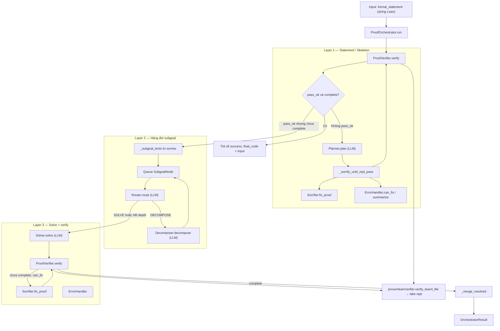

# Luồng hoạt động Proof Agent (từ một input formal)

Tài liệu mô tả đường đi của **một chuỗi Lean** (`formal_statement`) khi gọi `ProofOrchestrator.run()`, các **module** tham gia và **đoạn code** tương ứng trong repo.

---

## Điểm vào

- **API:** `ProofOrchestrator.run(formal_statement: str) -> OrchestratorResult`
- **File:** `prover/agent/proof_agent.py`

Khởi tạo orchestrator sẽ dựng sẵn các dependency (một lần):

```34:55:prover/agent/proof_agent.py
    def __init__(
        self,
        *,
        llm: Optional[LLMClient] = None,
        repl: Optional[LeanRepl] = None,
        timeout: int = 300,
        max_skeleton_fixes: int = 6,
        max_solver_attempts: int = 6,
        max_decompose_depth: int = 4,
    ) -> None:
        self.llm = llm or LLMClient()
        self.repl = repl or LeanRepl(timeout=timeout)
        self.verifier = ProofVerifier(self.repl, timeout=timeout)
        self.planner = Planner(self.llm)
        self.sorrifier = Sorrifier(self.llm)
        self.errors = ErrorHandler()
        self.router = Router(self.llm)
        self.decomposer = Decomposer(self.llm)
        self.solver = Solver(self.llm)
        ...
```

| Thành phần | Module | Vai trò ngắn |
|------------|--------|----------------|
| Trạng thái cây / log | `proof_state.py` | `ProofState`, `SubgoalNode`, enum trạng thái |
| LLM | `llm_client.py` | Chỉ gọi **server LLM local** (API kiểu chat completions); stub offline chỉ khi `LOCAL_LLM_MOCK=1` |
| REPL Lean | `lean_repl.py` | Bọc `verify_lean4_file` |
| Kiểm chứng | `verifier.py` | `ProofVerifier.verify` → `LeanRepl.eval` |
| Lõi Lean (repo cũ) | `prover/lean/verifier.py` | `lake exe repl`, parse JSON |

---

## Sơ đồ tổng quan (theo lớp)



---

## Layer 1: Kiểm tra ban đầu, Planner, sửa skeleton

### Bước 1 — REPL lần đầu trên input

- **Gọi:** `self.verifier.verify(formal_statement)` trong `run()`.
- **Chuỗi gọi:** `ProofVerifier.verify` → `LeanRepl.eval` → `verify_lean4_file`.

```61:63:prover/agent/proof_agent.py
        r0 = self.verifier.verify(formal_statement)
        state.initial_repl_snapshot = r0.raw
        state.log("layer1_initial_repl", pass_ok=r0.pass_ok, complete=r0.complete)
```

```14:15:prover/agent/verifier.py
    def verify(self, code: str, timeout: Optional[int] = None) -> LeanReplResult:
        return self.repl.eval(code, timeout=timeout)
```

```34:37:prover/agent/lean_repl.py
    def eval(self, code: str, timeout: Optional[int] = None) -> LeanReplResult:
        t = self.timeout if timeout is None else timeout
        raw = verify_lean4_file(code, timeout=t)
```

```13:31:prover/lean/verifier.py
def verify_lean4_file(code, timeout=300, **kwargs):
    """Hàm verify lõi, nhận code dạng string và trả về dict kết quả."""
    command = {"cmd": code}
    ...
            outputs = subprocess.run(
                [DEFAULT_LAKE_PATH, "exe", 'repl'], 
                stdin=temp_file, 
                ...
                cwd=DEFAULT_LEAN_WORKSPACE, 
                timeout=timeout
            )
```

### Bước 2 — Thoát sớm nếu đã hoàn chỉnh

Nếu Lean báo **không lỗi** và **không còn sorry** (`complete`), pipeline kết thúc ngay.

```65:73:prover/agent/proof_agent.py
        if r0.pass_ok and r0.complete:
            state.final_proof = formal_statement
            return OrchestratorResult(
                success=True,
                message="Statement already passes REPL with no sorry.",
                ...
            )
```

### Bước 3 — Nếu `pass_ok` là false: Planner + vòng sửa skeleton

- **Planner** (`planner.py`): LLM trả JSON `informal_plan` + `skeleton_code`.
- **_sorrify_until_repl_pass**: lặp `verify` → nếu lỗi và `ErrorHandler.can_fix` → `Sorrifier.fix_proof` → verify lại.

```75:82:prover/agent/proof_agent.py
        skeleton = formal_statement
        if not r0.pass_ok:
            plan = self.planner.plan(formal_statement)
            state.planner_output = plan
            ...
            skeleton = plan.skeleton_code
            skeleton, r_sk = self._sorrify_until_repl_pass(skeleton)
```

```145:157:prover/agent/proof_agent.py
    def _sorrify_until_repl_pass(self, skeleton: str) -> tuple[str, LeanReplResult]:
        code = skeleton
        last = self.verifier.verify(code)
        if last.pass_ok:
            return code, last
        for _ in range(self.max_skeleton_fixes):
            if not self.errors.can_fix(last):
                break
            code = self.sorrifier.fix_proof(code, self.errors.summarize(last))
            last = self.verifier.verify(code)
            if last.pass_ok:
                return code, last
        return code, last
```

### Bước 4 — Nếu `pass_ok` true nhưng chưa `complete`

Không gọi Planner; dùng kết quả REPL hiện tại làm skeleton (ví dụ file đã parse được nhưng còn `sorry`).

```83:85:prover/agent/proof_agent.py
        else:
            r_sk = r0
            layers["layer1"] = {"planner": False, "used_existing_skeleton": True}
```

### Bước 5 — Skeleton vẫn không `pass_ok` → thất bại Layer 1

```87:95:prover/agent/proof_agent.py
        state.skeleton_repl_snapshot = r_sk.raw
        if not r_sk.pass_ok:
            return OrchestratorResult(
                success=False,
                message="Skeleton still fails REPL after sorrifier loop; escalate.",
                ...
            )
```

---

## Layer 2: Subgoal từ sorries, Router, Decomposer

### Tách subgoal

Lấy text mục tiêu từ `r_sk.sorries[].goal`; nếu không có thì coi cả `skeleton` là một subgoal.

```159:165:prover/agent/proof_agent.py
    @staticmethod
    def _subgoal_texts(r: LeanReplResult, skeleton: str) -> list[str]:
        goals = [str(s.get("goal") or "").strip() for s in r.sorries]
        goals = [g for g in goals if g]
        if goals:
            return goals
        return [skeleton]
```

Mỗi subgoal tạo một `SubgoalNode` trong `ProofState` (`proof_state.py`) và đưa `id` vào queue.

```97:102:prover/agent/proof_agent.py
        subgoal_texts = self._subgoal_texts(r_sk, skeleton)
        queue: deque[str] = deque()
        for text in subgoal_texts:
            node = state.new_node(text.strip() or skeleton)
            node.meta["depth"] = 0
            queue.append(node.id)
```

### Router và Decomposer

- **Router** (`router.py`): LLM → `DECOMPOSE` hoặc `SOLVE`.
- Nếu `DECOMPOSE` và chưa vượt `max_decompose_depth` → **Decomposer** (`decomposer.py`) sinh list subgoal → tạo node con → đẩy lại queue.

```106:122:prover/agent/proof_agent.py
        while queue:
            nid = queue.popleft()
            node = state.nodes[nid]
            depth = int(node.meta.get("depth", 0))

            decision = self.router.route(node.formal_statement)
            ...
            if decision == RouteDecision.DECOMPOSE and depth < self.max_decompose_depth:
                subs = self.decomposer.decompose(node.formal_statement)
                node.status = NodeStatus.DECOMPOSED
                for s in subs:
                    ch = state.new_node(s, parent_id=nid)
                    ch.meta["depth"] = depth + 1
                    queue.append(ch.id)
                continue
```

---

## Layer 3: Solver, Verifier, Sorrifier (fix proof)

Với nhánh **SOLVE** (hoặc hết depth decompose), `_solve_node`:

1. **Solver.solve** sinh code Lean đầy đủ (LLM).
2. **ProofVerifier.verify** lặp; nếu `pass_ok` và `complete` → node `SOLVED`.
3. Nếu lỗi nhưng **ErrorHandler.can_fix** → **Sorrifier.fix_proof** rồi verify lại.
4. Hết số lần hoặc không sửa được → `FAILED` / `ESCALATED`, orchestrator trả `success=False`.

```167:193:prover/agent/proof_agent.py
    def _solve_node(self, node: SubgoalNode, state: ProofState) -> bool:
        node.status = NodeStatus.IN_PROGRESS
        proof = self.solver.solve(node.formal_statement)
        last: Optional[LeanReplResult] = None
        for attempt in range(1, self.max_solver_attempts + 1):
            last = self.verifier.verify(proof)
            ...
            if last.pass_ok and last.complete:
                node.resolved_proof = proof
                node.status = NodeStatus.SOLVED
                return True
            if not self.errors.can_fix(last):
                node.status = NodeStatus.ESCALATED
                ...
                return False
            proof = self.sorrifier.fix_proof(proof, self.errors.summarize(last))
            node.retry_count = attempt
        ...
```

**Lưu ý thiết kế:** `fill_skeleton()` trong `sorrifier.py` phục vụ luồng “lấp sorry trong skeleton”; trong code orchestrator hiện tại, vòng Layer 1 dùng chủ yếu `fix_proof` cho skeleton lỗi compile. Bạn có thể gọi thêm `fill_skeleton` trong `_sorrify_until_repl_pass` nếu muốn sát spec “SORRIFIER thay sorry bằng tactic”.

---

## Kết thúc thành công: ghép proof

```134:143:prover/agent/proof_agent.py
        merged = self._merge_resolved(state, skeleton)
        state.final_proof = merged
        layers["layer3"] = {"resolved_nodes": sum(1 for n in state.nodes.values() if n.status == NodeStatus.SOLVED)}
        return OrchestratorResult(
            success=True,
            message="Pipeline finished (proof quality depends on your local LLM).",
            state=state,
            final_code=merged,
            layers=layers,
        )
```

```195:200:prover/agent/proof_agent.py
    @staticmethod
    def _merge_resolved(state: ProofState, skeleton: str) -> str:
        parts = [n.resolved_proof for n in state.nodes.values() if n.resolved_proof]
        if not parts:
            return skeleton
        return "\n\n-- --- merged subproofs ---\n\n".join(parts)
```

---

## LLM local và môi trường

- **File:** `llm_client.py` — mọi `Planner` / `Router` / `Solver` / `Sorrifier` / `Decomposer` đều đi qua `LLMClient.complete()` tới **một endpoint local** (vLLM, Ollama OpenAI bridge, LM Studio, …). `LOCAL_LLM_MODEL` là id **do server của bạn định nghĩa** (bất kỳ tên nào server chấp nhận).
- Biến: `LOCAL_LLM_BASE_URL`, `LOCAL_LLM_MODEL`, tùy chọn `LOCAL_LLM_CHAT_PATH` (mặc định `v1/chat/completions`), `LOCAL_LLM_API_KEY`, `LOCAL_LLM_TIMEOUT_SEC` — xem `.env.example`.
- **`LOCAL_LLM_MOCK=1`:** chỉ dùng khi dev không có server; trả stub nội bộ theo `task=`, **không** thay cho model local.
- Nếu **không** bật mock mà thiếu `LOCAL_LLM_BASE_URL` hoặc `LOCAL_LLM_MODEL`, `complete()` ném lỗi (không gọi mạng).

---

## Thứ tự module theo một lượt điển hình

1. `proof_agent.py` — `ProofOrchestrator.run`
2. `verifier.py` — `ProofVerifier.verify`
3. `lean_repl.py` — `LeanRepl.eval`
4. `prover/lean/verifier.py` — `verify_lean4_file` → subprocess `lake exe repl`
5. (Nếu cần Layer 1 đầy đủ) `planner.py` → `llm_client.py`
6. `error_handler.py` + `sorrifier.py` (sửa skeleton)
7. `proof_state.py` — cập nhật `ProofState` / `SubgoalNode`
8. `router.py` → `decomposer.py` hoặc `solver.py` → lại bước 2–4
9. Kết quả: `OrchestratorResult` (`proof_agent.py`)

---

*Tệp này mô tả implementation hiện tại trong `prover/agent/`; có thể mở rộng (ví dụ AST từ REPL + `prover/lean/ast_parser.py`) mà không đổi luồng tổng thể.*
